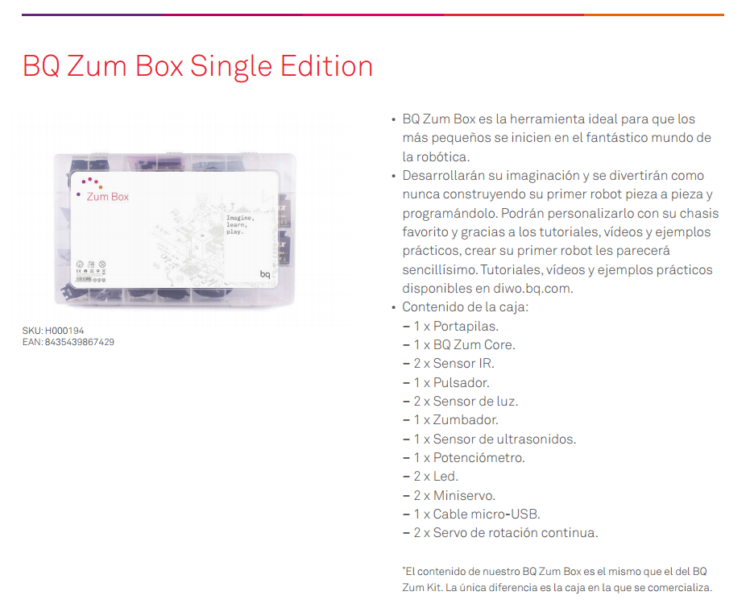
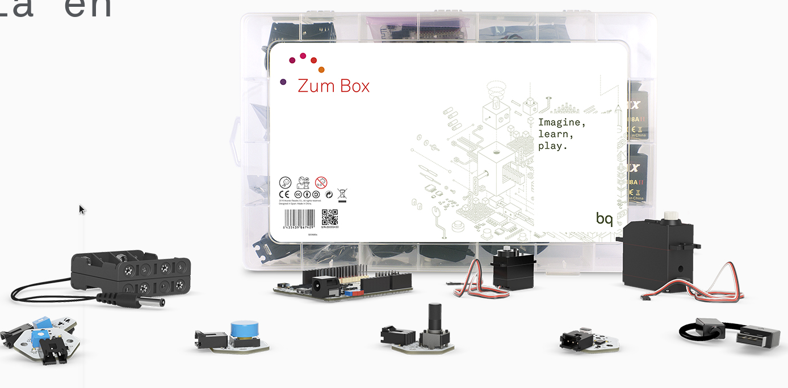

# Componentes

## Kit

## Alternativas

* [Kit de iniciación barato para Arduino](http://www.luisllamas.es/2016/11/kit-de-iniciacion-barato-para-empezar-en-arduino/)

* [Arduino Modules You Can Buy For Less Than $2 (each one)](http://randomnerdtutorials.com/21-arduino-modules-you-can-buy-for-less-than-2/)

* [20 Free Guides for Arduino Modules and Sensors](http://randomnerdtutorials.com/20-free-guides-for-arduino-modules-and-sensors/)
