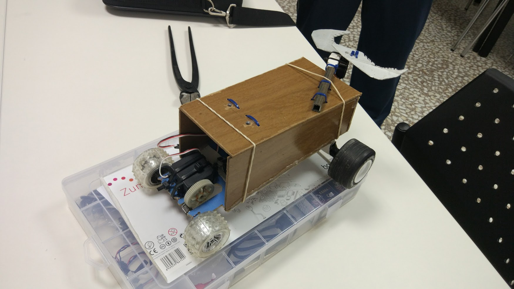

# Robot policia

Alumnos de 6º de primaria

Busca a los "cacos" que son Negros y no a los buenos (blancos)

* Piezas recicladas de radiocontrol
* Usamos hilo de cobre para conectar la pieza del servo con el engranaje
* Pinza que coge a los "cacos" accionada por servo

Mejoras:
* Hacer una lista de funcionalidades y elegir las que vamos a hacer
* Definir los requisitos y las funcionalidades previamente
* Definir y repartir tareas
* Ir mejorando el modelo con iteraciones

# Rover Marciano

3º ESO, 6 grupos de 3 nños

* Hecho en los recreos
* Basado en los planos del robot de lego
* Detecta obstáculos
* Trabajando en equipos

